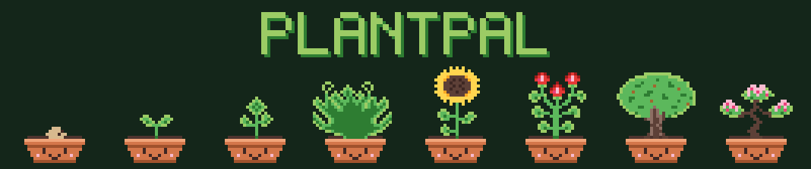

<p align="center"></p>

# PlantPal

A Tamagotchi-style plant for Zepp OS square watches (Amazfit Active 2 Square, Bip 6, Active, GTS 4, …).

- **Water / Sun** buttons and **tap the plant** for love. Needs drain in real time, even while the app is closed.
- A need below 20 makes the plant **wilt**: growth pauses until you care for it again. It never dies.
- **Steps** give bonus growth (1 per 500 steps, max 30/day). They're credited whenever you open the app, and by a silent check-in at 23:30 and 23:55 (`app-service/nightly.js`), so no steps are lost overnight.
- Seed → Sprout → Sapling → Young → Bloom (~4–8 days). The need you keep topped up decides the final form:
  water → Fern, sun → Sunflower, love → Rose, walking → Oak, balanced → Bonsai.
- The top line shows the time and the plant's age (Day 1 = planting day).
- After it blooms, **Seed** moves it into your Garden and starts a new plant. Swipe up for stats.

## Develop

```sh
npm install
npm test               # game logic unit tests
npm run sprites        # regenerate PNGs (and docs/banner.png) from tools/sprites/art.mjs
                       #   (add `-- --preview sheet.png` for a contact sheet)
zeus dev               # run in the simulator
zeus preview           # QR code to install on the watch (Zepp app → Developer Mode → Scan)
zeus build             # .zab in dist/
python3 tools/store_screenshots.py   # 360x360 store screenshots in store/screenshots/
```

Store listing texts, privacy statement and asset checklist: `store/listing.md`.

Set `TIME_SCALE = 60` in `lib/game.js` to make an hour pass per minute while testing (a test guards it's 1 for release).

Game logic lives in `lib/game.js` (pure, no `@zos` imports); `lib/store.js` handles storage and the step sensor.

## License

[MIT](LICENSE) © 2026 Nils Flaschel
